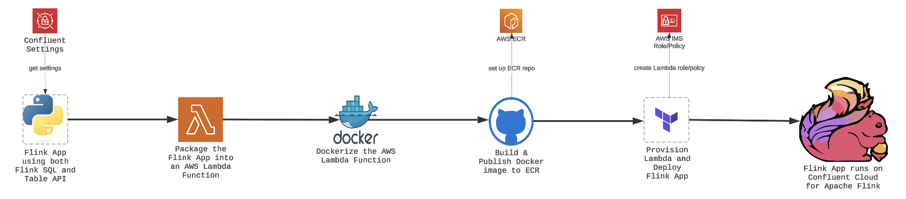
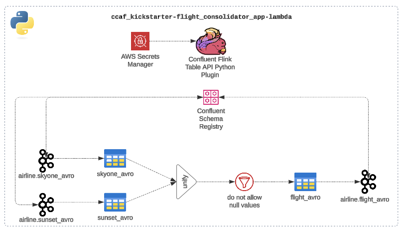
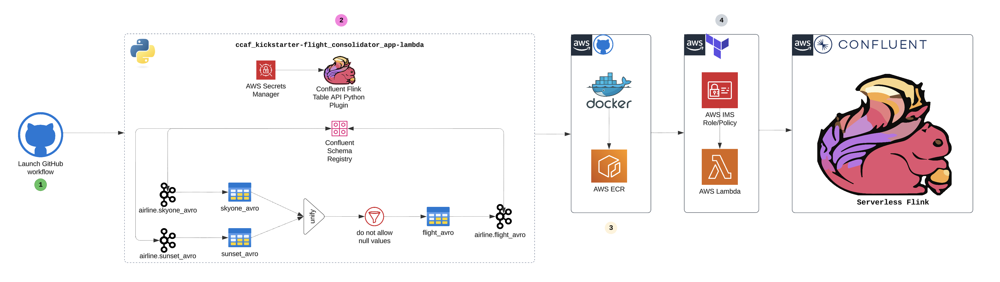

# Confluent Cloud for Apache Flink: Best Practices for Deploying Table API Applications with GitHub and Terraform

> _This is the first in our year-long “Best Practices in Action” series, where my team and I will share proven strategies for success._

**TL; DR:** _Kickstart your Flink app on Confluent Cloud by packaging it as an AWS Lambda, then power it all with a GitHub + Terraform CI/CD pipeline._

From the moment [Confluent Cloud for Apache Flink (CCAF)](https://docs.confluent.io/cloud/current/flink/overview.html) entered Early Preview in late 2023, I was immediately captivated by its possibilities. Determined to leverage its power, I integrated the [Confluent Terraform Provider](https://registry.terraform.io/providers/confluentinc/confluent/latest/docs) with GitHub to create a robust CI/CD pipeline—enabling my organization and our clients to benefit from reliable, managed Flink solutions. By following Confluent’s [recommendations](https://docs.confluent.io/cloud/current/flink/operate-and-deploy/deploy-flink-sql-statement.html) and [reference examples](https://github.com/confluentinc/terraform-provider-confluent/tree/master/examples/configurations), I swiftly developed a Terraform-based workflow that automated the delivery of Flink SQL statements. However, when Confluent released [Table API](https://docs.confluent.io/cloud/current/flink/reference/table-api.html) support for Java and Python in mid-2024, it became clear that an entirely new approach was needed. With no predefined best practices for deploying Table API-based Flink applications in a CI/CD pipeline, I found myself charting untested territory to ensure we could fully harness this expanded functionality.


After weighing the trade-offs of different strategies, I landed on the following best-practice approach for automating a CI/CD pipeline for CCAF:
1.	**Package Your Code:** Build an AWS Lambda function (AWS is my hyperscaler of choice).
2.	**Dockerize:** Create a Dockerfile for the Lambda function.
3.	**Set Up ECR:** Create an AWS Elastic Container Registry (ECR) to host Docker images.
4.	**Build & Publish:** From GitHub, build the Docker image and push it to ECR.
5.	**Provision Lambda:** Use Terraform from GitHub to spin up the Lambda function.
6.	**Deploy Flink App:** Invoke the Lambda (via Terraform) to deploy your Confluent Cloud for Apache Flink application.

The diagram below brings this entire pipeline to life, showing how each component fits seamlessly together to deliver your Confluent Cloud for Apache Flink application:



## 1.0 Why This Approach

**Why did I choose the AWS Lambda service over hosting code in a docker container in the AWS Fargate container service?**  While both services are powerful serverless compute options, each shines in different scenarios:

- AWS Lambda is ideal for _event-driven_, _short-lived_, and _stateless_ tasks.
- AWS Fargate excels in running _containerized_, _long-running_, and _stateful_ applications.

Because deploying a Flink Application (a.k.a. Flink Job) to Confluent Cloud for Apache Flink (CCAF) is a _short-lived_, _**one-time push**_ that requires _no persistent state_, AWS Lambda is a wise choice, IMHO.


**Why Dockerize the Lambda function?**  It’s a strategic choice when your code requires large, intricate dependencies—like the `confluent-flink-table-api-python-plugin`, which needs both Java and Python in one environment.  By packaging everything into a Docker container, you gain full control over your runtime, seamlessly manage custom dependencies, and streamline CI/CD pipelines for consistent, frictionless deployments.

**Why AWS ECR?**  As the native container registry in AWS, ECR delivers frictionless integration with AWS Lambda, ensuring secure, efficient storage and management of Docker images—all within the AWS ecosystem.

**Why Terraform?**  It unlocks the power of automated infrastructure provisioning, bringing Infrastructure as Code (IaC) principles to your AWS Lambda environment. This modern DevOps approach empowers you to build, deploy, and maintain resilient, scalable applications—all from a single source of truth.

## 2.0 Now See This Best Practice in Action
To illustrate this approach, I’m leveraging the [Apache Flink Kickstarter Flink App—powered by Python on Confluent Cloud for Apache Flink (CCAF)](https://github.com/j3-signalroom/apache_flink-kickstarter/tree/main/ccaf)—-as a prime example of the code you’d deploy to CCAF. Now, let’s dive right in!


### 2.1 The Code

If you want to get right into the code, you can find the full implementation in the [GitHub repository](https://github.com/j3-signalroom/ccaf_kickstarter-flight_consolidator_app-lambda).  Here is a detail overview of the code that follows:

#### 2.1.1 Python Intepreter, Packages and Dependencies + Java 17 JDK you need

To get started, you’ll need to set up your Python virtual environment to run Python 3.11.x intepreter with the following packages and dependencies:
- ```confluent-flink-table-api-python-plugin```, verion `1.20.42` or later -- this is the Python Table API plugin for Confluent Cloud for Apache Flink, which allows you to run Python code on Flink.
- ```boto3```, version `1.35.90` or later -- this is the AWS SDK for Python, which allows you to interact with AWS services.  The AWS Service the app interacts with is AWS Lambda and AWS Secrets Manager.
- ```setuptools```, version `65.5.1` or later -- allows you to install a package without copying any files to your interpreter directory (e.g. the `site-packages` directory).  This allows you to modify your source code and have the changes take effect without you having to rebuild and reinstall.

> You maybe wondering why Python 3.11.x.  Well, `confluent-flink-table-api-python-plugin` runs on top of [`PyFlink 1.20.x`](https://nightlies.apache.org/flink/flink-docs-release-1.20/api/python/), and its upper limit [support for Python is 3.11.x](https://nightlies.apache.org/flink/flink-docs-release-1.20/docs/dev/python/installation/).

Here’s the `pyproject.toml` file that specifies the Python version and dependencies:
```python
[project]
name = "flight_consolidator_app"
version = "0.03.00.000"
description = "Confluent Cloud for Apache Flink (CCAF) Flight Consolidator App Lambda"
readme = "README.md"
authors = [
    { name = "Jeffrey Jonathan Jennings (J3)", email = "j3@thej3.com" }
]
requires-python = "~=3.11.9"
dependencies = [
    "boto3>=1.35.90",
    "confluent-flink-table-api-python-plugin>=1.20.42",
    "setuptools>=65.5.1",
]
```

Here's the `.python-version` file that specifies the Python version being used:
```text
3.11.9
```

Plus, you’ll need the Java 17 JDK to run the `confluent-flink-table-api-python-plugin`, because it calls Java JAR files.

##### 2.1.1.1 A Word on the Python Package Manager of Choice: Astral `uv`
Now, if you are new to my post on [LinkedIn](https://www.linkedin.com/in/jeffreyjonathanjennings/), [blogs](https://thej3.com/), or [GitHub projects](https://github.com/j3-signalroom), you don't know, but I am a total Fanboy of [Astral](https://astral.sh/)'s `uv` Python Package Manager.  You maybe asking yourself why.  Well, `uv` is an incredibly fast Python package installer and dependency resolver, written in [**Rust**](https://github.blog/developer-skills/programming-languages-and-frameworks/why-rust-is-the-most-admired-language-among-developers/), and designed to seamlessly replace `pip`, `pipx`, `poetry`, `pyenv`, `twine`, `virtualenv`, and more in your workflows. By prefixing `uv run` to a command, you're ensuring that the command runs in an optimal Python environment **AUTOMATICALLY**.

Curious to learn more about [Astral](https://astral.sh/)'s `uv`? Check these out:
- Documentation: Learn about [`uv`](https://docs.astral.sh/uv/).
- Video: [`uv` IS THE FUTURE OF PYTHON PACKING!](https://www.youtube.com/watch?v=8UuW8o4bHbw)

#### 2.1.2 The ```handler.py``` Python Script File



To keep things streamlined, I consolidated all import statements, constants, and the AWS Lambda handler function into a single module—the code in `handler.py` is the real star here.  The Lambda function reads data from two Kafka topics, combines the data, and writes the combined data to a Kafka sink topic.  The Lambda function is triggered by an event that contains the catalog name, database name, and path to the Confluent Cloud for Apache Flink secrets in AWS Secrets Manager.  The Lambda function uses the Confluent Cloud for Apache Flink secrets to create a TableEnvironment with the Confluent Cloud for Apache Flink settings.  The Lambda function then creates the Kafka sink table in the Confluent Cloud for Apache Flink catalog, reads data from the airline table, combines the data, and writes the combined data to the Kafka sink table.

What follows is a breakdown of its structure:

##### 2.1.2.1 Import Statements
Here are the import statements you’ll need to include at the top of your Python script:

```python
from pyflink.table import TableEnvironment, Schema, DataTypes, FormatDescriptor
from pyflink.table.catalog import ObjectPath
from pyflink.table.confluent import ConfluentTableDescriptor, ConfluentSettings, ConfluentTools
from pyflink.table.expressions import col, lit
import uuid
from functools import reduce
import boto3
from botocore.exceptions import ClientError
import json
import logging
```

##### 2.1.2.2 Constants
I love leveraging constants to keep code clear, maintainable, and future-proof.  Below are the essential constants you’ll want to include at the top of your Python script:

```python
# Confluent Cloud for Apache Flink Secrets Keys
ENVIRONMENT_ID = "environment.id"
FLINK_API_KEY = "flink.api.key"
FLINK_API_SECRET = "flink.api.secret"
FLINK_CLOUD = "flink.cloud"
FLINK_COMPUTE_POOL_ID = "flink.compute.pool.id"
FLINK_PRINCIPAL_ID = "flink.principal.id"
FLINK_REGION = "flink.region"
ORGANIZATION_ID = "organization.id"
```

##### 2.1.2.3 The Lambda Handler Function
The Lambda function serves as the entry point for your AWS Lambda application written in Python. It is a Python function that AWS Lambda invokes when your Lambda function is executed (i.e, invoked).  So, to put it another way, as my mom 💜 would say (yes, she was a programmer back in the day), this is where your Flink app’s life begins! 🚀

The code uses a basic signature for the handler function, which is required by AWS Lambda:

```python
def handler(event, context):
    """
    This AWS Lambda function is the main entry point for the Flink app.  It defines
    the Kafka sink table, reads from source tables, transforms the data, and writes
    to the sink.

    Arg(s):
        event (Dict)           :  The event data passed to the Lambda function.
        context (LambdaContext):  The metadata about the invocation, function, and 
                                  execution environment.

    Returns:
        statusCode with a message in the body: 
            200 for a successfully run of the function.
            400 for a missing required field.
            500 for a critical error.
    """
```

**The handler function** accepts two critical arguments:

- **event (Dict)** – Typically generated by AWS services (e.g., S3 or API Gateway). In this example, it’s the JSON object from Terraform that AWS Lambda receives.  
- **context (LambdaContext)** – An object holding details about the function’s invocation, configuration, and runtime environment.

As you’ll see when we walk through the code, the handler returns a **JSON-serializable dictionary**—that contains a `statusCode` and `body`—to track and communicate the success or failure of the deployment.

In the next sections, we’ll break down the handler function into nine parts to explain the logic and flow of the code.

###### 2.1.2.3.1 Part 1 of 9 of the Lambda Handler Function Code
The code snippet below sets up a logger to log messages at the INFO level. The logger is used to log messages to the AWS CloudWatch Logs service, which is a centralized logging service provided by AWS.

```python
    # Set up the logger.
    logger = logging.getLogger()
    logger.setLevel(logging.INFO)
```

###### 2.1.2.3.2 Part 2 of 9 of the Lambda Handler Function Code
The code snippet below checks that all required fields for the event exist. If any of the required fields are missing, the code logs an error message and returns a JSON object with a status code of 400 and an error message in the body.  The `catalog_name` field contains the name of the Confluent Cloud for Apache Flink catalog, the `database_name` field contains the name of the database in the catalog, and the `ccaf_secrets_path` field contains the path to the Confluent Cloud for Apache Flink secrets in AWS Secrets Manager.

```python
     # Check all required fields for the event exist.
    required_event_fields = ["catalog_name", "database_name", "ccaf_secrets_path"]
    for field in required_event_fields:
        if field not in event:
            logger.error(f"Missing required field: {field}")
            return {
                'statusCode': 400,
                'body': json.dumps({'error': f'Missing required field: {field}'})
            }

    # Get the required fields from the event.
    catalog_name = event["catalog_name"]
    database_name = event["database_name"]
    ccaf_secrets_path = event["ccaf_secrets_path"]
```

###### 2.1.2.3.3 Part 3 of 9 of the Lambda Handler Function Code
The code snippet below gets the Confluent Cloud for Apache Flink secrets from AWS Secrets Manager using the `ccaf_secrets_path` field. If the secrets are successfully retrieved, the code creates a TableEnvironment with the Confluent Cloud for Apache Flink settings. If the secrets cannot be retrieved, the code logs an error message and returns a JSON object with a status code of 500 and an error message in the body.

```python
    try:
        get_secret_value_response = boto3.client('secretsmanager').get_secret_value(SecretId=secrets_path)
        settings = json.loads(get_secret_value_response['SecretString'])

        # Create the TableEnvironment with the Confluent Cloud for Apache Flink settings.
        tbl_env = TableEnvironment.create(
            ConfluentSettings
                .new_builder()
                .set_cloud(settings[FLINK_CLOUD])
                .set_region(settings[FLINK_REGION])
                .set_flink_api_key(settings[FLINK_API_KEY])
                .set_flink_api_secret(settings[FLINK_API_SECRET])
                .set_organization_id(settings[ORGANIZATION_ID])
                .set_environment_id(settings[ENVIRONMENT_ID])
                .set_compute_pool_id(settings[FLINK_COMPUTE_POOL_ID])
                .set_principal_id(settings[FLINK_PRINCIPAL_ID])
                .build()
        )
    except ClientError as e:
        logger.error("Failed to get secrets from the AWS Secrets Manager because of %s.", e)
        return {
            'statusCode': 500,
            'body': json.dumps({'error': str(e)})
        }
```

> **Note:** _It is assumpted that you have already created the Confluent Cloud for Apache Flink secrets in AWS Secrets Manager when you ran the Terraform configuration in the [Apache Flink Kickstarter](https://github.com/j3-signalroom/apache_flink-kickstarter) Project.  If you have not, you can follow the instructions in the [README](https://github.com/j3-signalroom/apache_flink-kickstarter/blob/main/README.md#20-lets-get-started)._

###### 2.1.2.3.4 Part 4 of 9 of the Lambda Handler Function Code
The code snippet below sets the current catalog and database in the TableEnvironment. The code then gets the catalog from the TableEnvironment using the `catalog_name` field.

```python
    # The catalog name and database name are used to set the current catalog and database.
    tbl_env.use_catalog(catalog_name)
    tbl_env.use_database(database_name)
    catalog = tbl_env.get_catalog(catalog_name)
```

###### 2.1.2.3.5 Part 5 of 9 of the Lambda Handler Function Code
The code snippet below creates the Kafka sink table in the Confluent Cloud for Apache Flink catalog. The sink table is created with an Avro serialization format. The sink table has eight columns: `departure_airport_code`, `flight_number`, `email_address`, `departure_time`, `arrival_time`, `arrival_airport_code`, `confirmation_code`, and `airline`. The sink table is distributed by `departure_airport_code` and `flight_number` into one bucket. The sink table has an Avro key format and an Avro value format.

```python
    # The Kafka sink table Confluent Cloud environment Table Descriptor with Avro serialization.
    flight_avro_table_descriptor = (
        ConfluentTableDescriptor
            .for_managed()
            .schema(
                Schema
                    .new_builder()
                    .column("departure_airport_code", DataTypes.STRING())
                    .column("flight_number", DataTypes.STRING())
                    .column("email_address", DataTypes.STRING())
                    .column("departure_time", DataTypes.STRING())
                    .column("arrival_time", DataTypes.STRING())
                    .column("arrival_airport_code", DataTypes.STRING())
                    .column("confirmation_code", DataTypes.STRING())
                    .column("airline", DataTypes.STRING())
                    .build())
            .distributed_by_into_buckets(1, "departure_airport_code", "flight_number")
            .key_format(FormatDescriptor.for_format("avro-registry").build())
            .value_format(FormatDescriptor.for_format("avro-registry").build())
            .build()
    )
    try:
        # Checks if the table exists.  If it does not, it will be created.
        flight_avro_table_path = ObjectPath(tbl_env.get_current_database(), "flight_avro")
        if not catalog.table_exists(flight_avro_table_path):
            tbl_env.create_table(
                flight_avro_table_path.get_full_name(),
                flight_avro_table_descriptor
            )
            logger.info(f"Sink table '{flight_avro_table_path.get_full_name()}' created successfully.")
        else:
            logger.info(f"Sink table '{flight_avro_table_path.get_full_name()}' already exists.")
    except Exception as e:
        logger.error(f"A critical error occurred during the processing of the table because {e}")
        return {
            'statusCode': 500,
            'body': json.dumps({'error': str(e)})
        }
```

###### 2.1.2.3.6 Part 6 of 9 of the Lambda Handler Function Code
The code snippet below gets the schema and columns from the airline table. The code then creates two tables: one for the SkyOne airline and one for the Sunset airline. The SkyOne table contains all columns from the airline table except for the excluded columns. The Sunset table contains all columns from the airline table except for the excluded columns.

```python
    # The first table is the SkyOne table that is read in.
    airline = tbl_env.from_path(f"{catalog_name}.{database_name}.skyone_avro")

    # Get the schema and columns from the airline table.
    schema = airline.get_schema()

    # The columns that are not needed in the table the represents general airline flight data.
    exclude_airline_columns = ["key", "flight_duration", "ticket_price", "aircraft", "booking_agency_email", "$rowtime"]
    
    # Get only the columns that are not in the excluded columns list.
    flight_expressions = [col(field) for field in schema.get_field_names() if field not in exclude_airline_columns]
    flight_columns = [field for field in schema.get_field_names() if field not in exclude_airline_columns]

    # The first table is the SkyOne table that is read in.
    skyone_airline = airline.select(*flight_expressions, lit("SkyOne"))

    # The second table is the Sunset table that is read in.
    sunset_airline = airline.select(*flight_expressions, lit("Sunset"))
```

> **Note:** _It is assumpted that you have already created and filled with records the `airline.skyone_avro` and `airline.sunset_avro` Kafka topics when you played with the [Apache Flink Kickstarter](https://github.com/j3-signalroom/apache_flink-kickstarter) Project.  If you have not, you can follow the instructions in the [README](https://github.com/j3-signalroom/apache_flink-kickstarter/blob/main/java/README.md#21-avro-formatted-data)._

###### 2.1.2.3.7 Part 7 of 9 of the Lambda Handler Function Code
The code snippet below constructs a filter condition that ensures all columns specified in the flight_columns list are not null.   This type of functional programming code is commonly used in data streaming frameworks like Apache Flink or Apache Spark to filter out records that contain null values in any of the specified columns.

```python
    # Build a compound expression, ensuring each column is not null
    filter_condition = reduce(
        lambda accumulated_columns, current_column: accumulated_columns & col(current_column).is_not_null, flight_columns[1:], col(flight_columns[0]).is_not_null
    )
```

The above code snippet demonstrates functional programming principles in Python. While it may not cover all aspects of functional programming, it effectively utilizes key constructs: 

- Utilizing higher-order functions (`reduce`).
- Employing `lambda` functions [not to be confused with AWS Lambda functions 😉] for concise, inline operations.
- Maintaining immutability by not altering the original data structures.
- Adopting a declarative approach to specify data transformations.

I highlighted this code snippet to emphasize the importance of functional programming in data streaming frameworks like Apache Flink or Apache Spark. Functional programming is a powerful paradigm that can help you write more concise, readable, and maintainable code. By leveraging functional programming constructs, you can easily express complex data transformations and processing logic clearly and concisely. Moreover, it shows that with the Table API in CCAF, you can use your functional programming skills in Flink just as in other Python application development. This is an excellent way to leverage your existing Python skills and apply them to the world of data streaming and processing. _One of **my clients** wanted to know if this was possible, and I was able to demonstrate that it is, and so can you!_

###### 2.1.2.3.8 Part 8 of 9 of the Lambda Handler Function Code
The code snippet below combines the two tables, the SkyOne table and the Sunset table, into one table. The combined table is filtered using the filter condition to ensure that all columns specified in the flight_columns list are not null.

```python
    # Combine the two tables.
    combined_airlines = (
        skyone_airline.union_all(sunset_airline)
        .alias(*flight_columns, "airline")
        .filter(filter_condition)
    )
```

###### 2.1.2.3.9 Part 9 of 9 of the Lambda Handler Function Code
The code snippet below inserts the combined record into the sink table. If the record is successfully inserted into the sink table, the code logs a message indicating that the data was processed and inserted successfully. If an error occurs during data insertion, the code logs an error message and returns a JSON object with a status code of 500 and an error message in the body.

```python
    # Insert the combined record into the sink table.
    try:
        # Supply a friendly statement name to easily search for it only in the Confluent Web UI.
        # However, the name is required to be unique within environment and region, so a UUID is
        # added.
        statement_name = "combined-flight-data-" + str(uuid.uuid4())
        tbl_env.get_config().set("client.statement-name", statement_name)

        # Execute the insert statement.
        table_result = combined_airlines.execute_insert(flight_avro_table_path.get_full_name())

        # Get the processed statement name.
        processed_statement_name = ConfluentTools.get_statement_name(table_result)
        success_message = f"Data processed and inserted successfully as: {processed_statement_name}"
        logger.info(success_message)
        return {
            'statusCode': 200,
            'body': json.dumps({'message': success_message})
        }
    except Exception as e:
        logger.error(f"An error occurred during data insertion: {e}")
        return {
            'statusCode': 500,
            'body': json.dumps({'error': str(e)})
        }
```

#### 2.1.3 The ```Dockerfile``` File
The Dockerfile is a text file that contains a series of commands that are executed by the Docker daemon to build a Docker image.  The `public.ecr.aws/lambda/python:3.11.2024.11.22.15` Docker image is the official AWS-provided base image specifically designed for creating container-based AWS Lambda functions using Python.  Also, this Dockerfile installs the Java 17 JDK, sets the JAVA_HOME environment variable, installs the required Python packages, copies the handler.py Python script to the Lambda function directory, and sets the handler for the Lambda function.

Below is the Dockerfile you’ll need to create to package the Lambda function as a Docker container:

```dockerfile
FROM public.ecr.aws/lambda/python:3.11.2024.11.22.15

# Install Java 17
RUN yum clean all && \
    yum -y update && \
    yum -y install java-17-amazon-corretto-devel && \
    yum clean all

# Container metadata
LABEL maintainer=j3@thej3.com \
      description="Apache Flink Kickstarter Project, showcasing Confluent Clound for Apache Flink"

# Set JAVA_HOME
ENV JAVA_HOME=/usr/lib/jvm/java-17-amazon-corretto
ENV PATH=$JAVA_HOME/bin:$PATH

# Install Confluent Cloud for Apache Flink and other dependencies
COPY requirements.txt .
RUN pip install --upgrade pip
RUN pip install -r requirements.txt

# Copy the application code
COPY handler.py ${LAMBDA_TASK_ROOT}

# Set the handler
CMD ["handler.lambda_handler"]
```

#### 2.1.4 The ```requirements.txt``` File
The requirements.txt file contains a list of Python packages that are required by the Lambda function.  Here’s the requirements.txt file you’ll need to create to install the required Python packages:

```text
boto3>=1.35.90
confluent-flink-table-api-python-plugin>=1.20.42
setuptools>=65.5.1
lxml==4.9.2
```

## 2.2 GitHub: The CI/CD Pipeline

*** **TO BE COMPLETED** ***

## 2.3 The Terraform Configuration
Terraform is a powerful tool for automating infrastructure provisioning and management.  In this section, we’ll walk through the Terraform configuration that provisions the AWS Lambda function and deploys the Confluent Cloud for Apache Flink application.


> **Note:**  _I use Terraform Cloud, a comprehensive, managed cloud service provided by HashiCorp that enhances the capabilities of Terraform for Infrastructure as Code (IaC). It offers a suite of features designed to streamline, secure, and optimize the process of provisioning and managing infrastructure across various environments._

Our Terraform project is organized into four configuration files:
- ```main.tf```: The primary Terraform configuration file that sets the Terraform cloud settings and define the local variables that will be used throughout defines the AWS Lambda function and the required resources.
- ```variables.tf```: The Terraform variables file that defines the input variables used in the Terraform configuration.
- ```provider.tf```: The Terraform provider file that defines the AWS provider configuration.
- ```aws-lambda-setup.tf```: The Terraform file that defines the AWS Lambda function and the required resources.

### 2.3.1 The ```main.tf``` Terraform Configuration File
The `main.tf` file is the primary Terraform configuration file in our Terraform project.  It is the entry point where we:
- Define High-Level Resources
- Reference Variables and Modules
- Orchestrate Dependencies

In this project, we define the Terraform cloud settings, local variables, and the AWS provider configuration.  We also reference the `variables.tf` file to define the input variables used in the Terraform configuration.  The `main.tf` file is the central configuration file

Below is the configuration of the `main.tf` file:
```hcl
terraform {
    cloud {
      organization = "signalroom"

        workspaces {
            name = "ccaf-kickstarter-flight-consolidator-app"
        }
  }

  required_providers {
        aws = {
            source  = "hashicorp/aws"
            version = "~> 5.82.2"
        }
    }
}

locals {
    # Repo name and URIs
    repo_name    = "ccaf_kickstarter-flight_consolidator_app"
    repo_uri     = "${var.aws_account_id}.dkr.ecr.${var.aws_region}.amazonaws.com/${local.repo_name}:latest"
    ecr_repo_uri = "arn:aws:ecr:${var.aws_region}:${var.aws_account_id}:repository/${local.repo_name}"
}
```

Below is a breakdown of the key components of the `main.tf` file:
- **cloud** block: Configures Terraform to use Terraform Cloud, specifying the `organization` (`signalroom`) and the `workspace` (`ccaf-kickstarter-flight-consolidator-app`).

    > **Note:** _The organization key specifies the Terraform Cloud `organization` that the workspace belongs to. The `workspace` key specifies the name of the workspace within the organization.  You need to change the `organization` to the organization name defined in your Terraform Cloud account._

- **required_providers** block: Declares the AWS provider from the HashiCorp registry, pinning it to version `~> 5.82.2`.
- **local** block: Defines local variables that are used throughout the Terraform configuration. 
   * **repo_name**: Defines a short, descriptive name for the Docker image repository in Amazon ECR.  
   * **repo_uri**: Constructs the full URI (account + region + repository name + `:latest` tag) for pushing/pulling Docker images.  
   * **ecr_repo_uri**: Defines the Amazon Resource Name (ARN) of the ECR repository, used by other Terraform resources that need to reference the repository.

### 2.3.2 The ```variables.tf``` Terraform Configuration File
```hcl
variable "aws_region" {
    description = "The AWS Region."
    type        = string
}

variable "aws_account_id" {
    description = "The AWS Account ID."
    type        = string
}

variable "aws_access_key_id" {
    description = "The AWS Access Key ID."
    type        = string
    default     = ""
}

variable "aws_secret_access_key" {
    description = "The AWS Secret Access Key."
    type        = string
    default     = ""
}

variable "aws_session_token" {
    description = "The AWS Session Token."
    type        = string
    default     = ""
}

variable "catalog_name" {
    description = "The CCAF Catalog Name."
    type        = string
    default     = ""
}

variable "database_name" {
    description = "The CCAF Database Name."
    type        = string
    default     = ""
}

variable "ccaf_secrets_path" {
    description = "The CCAF AWS Secrets Manager secrets path."
    type        = string
}

variable "aws_lambda_memory_size" {
    description = "AWS Lambda allocates CPU power in proportion to the amount of memory configured. Memory is the amount of memory available to your Lambda function at runtime. You can increase or decrease the memory and CPU power allocated to your function using the Memory setting. You can configure memory between 128 MB and 10,240 MB in 1-MB increments. At 1,769 MB, a function has the equivalent of one vCPU (one vCPU-second of credits per second)."
    type = number
    default = 128
    
    validation {
        condition = var.aws_lambda_memory_size >= 128 && var.aws_lambda_memory_size <= 10240
        error_message = "AWS Lambda memory size, `aws_lambda_memory_size`, must be 1 up to a maximum value of 10,240."
    }
}

variable "aws_lambda_timeout" {
    description = "AWS Lambda runs your code for a set amount of time before timing out. Timeout is the maximum amount of time in seconds that a Lambda function can run. The default value for this setting is 900 seconds, but you can adjust this in increments of 1 second up to a maximum value of 900 seconds (15 minutes)."
    type = number
    default = 900
    
    validation {
        condition = var.aws_lambda_timeout >= 1 && var.aws_lambda_timeout <= 900
        error_message = "AWS Lambda timeout, `aws_lambda_timeout`, must be 1 up to a maximum value of 900."
    }
}

variable "aws_log_retention_in_days" {
    description = "Specifies the number of days you want to retain log events in the specified log group. Possible values are: 1, 3, 5, 7, 14, 30, 60, 90, 120, 150, 180, 365, 400, 545, 731, 1096, 1827, 2192, 2557, 2922, 3288, 3653, and 0. If you select 0, the events in the log group are always retained and never expire."
    type = number
    default = 7

    validation {
        condition = contains([1, 3, 5, 7, 14, 30, 60, 90, 120, 150, 180, 365, 400, 545, 731, 1096, 1827, 2192, 2557, 2922, 3288, 3653, 0], var.aws_log_retention_in_days)
        error_message = "AWS Log Retention in Days, `aws_log_retention_in_days`, must be 1 up to a maximum value of 900."
    }
}
```

Below is a quick overview of the Terraform variables defined here:

1. **AWS Configuration**  
   - **aws_region** (string)  
   - **aws_account_id** (string)  
   - **aws_access_key_id**, **aws_secret_access_key**, **aws_session_token** (strings)  
   These variables capture your AWS credentials and region details, ensuring Terraform can authenticate and deploy resources in the correct AWS environment.

2. **Confluent Cloud for Apache Flink (CCAF) Settings**  
   - **catalog_name** (string)  
   - **database_name** (string)  
   - **ccaf_secrets_path** (string)  
   These parameters help configure and manage your CCAF resources (e.g., specifying the catalog and database, plus an AWS Secrets Manager path).

3. **Lambda Resource Configuration**  
   - **aws_lambda_memory_size** (number; validated between 128 MB and 10,240 MB)  
     - Controls how much memory (and proportionate CPU) is allocated to the Lambda function.  
   - **aws_lambda_timeout** (number; validated between 1 and 900 seconds)  
     - Determines how long the function can run before timing out (up to 15 minutes).  
   - **aws_log_retention_in_days** (number; must be one of the allowed values)  
     - Specifies how long CloudWatch logs are kept—0 to never expire, or a set of valid retention periods.

Each variable includes descriptions and validation rules, helping ensure your Lambda function and CCAF environment are configured correctly while preventing invalid or unsupported settings.

### 2.3.3 The ```provider.tf``` Terraform Configuration File
```hcl
provider "aws" {
    region     = var.aws_region
    access_key = var.aws_access_key_id
    secret_key = var.aws_secret_access_key
    token      = var.aws_session_token
}
```
Below is a quick explanation of the **AWS provider** configuration:

- **Region:** Tells Terraform which AWS region to target for resource creation.  
- **Credentials:** Pulls access keys and session tokens from variables, allowing Terraform to authenticate with AWS.  

This setup ensures Terraform can manage AWS resources under the specified account and region, using the provided credentials.

### 2.3.4 The ```aws-lambda-setup.tf``` Terraform Configuration File
Below is a detail walkthrough of how this Terraform configuration provisions the Lambda function and supporting AWS resources:

1. **IAM Role & Assume Role Policy**  
   ```hcl
   data "aws_iam_policy_document" "assume_role" {
     statement {
       effect = "Allow"
       principals {
         type        = "Service"
         identifiers = ["lambda.amazonaws.com"]
       }
       actions = ["sts:AssumeRole"]
     }
   }

   resource "aws_iam_role" "flight_consolidator_lambda" {
     name               = "ccaf_flight_consolidator_app_role"
     assume_role_policy = data.aws_iam_policy_document.assume_role.json
   }
   ```
   - Creates a role that Lambda can assume, granting the necessary trust relationship.

2. **Secrets Manager & Custom Policy**  
   ```hcl
    data "aws_secretsmanager_secret" "ccaf_secrets_path" {
        name = var.ccaf_secrets_path
    }

   resource "aws_iam_policy" "flight_consolidator_lambda_policy" {
        name        = "ccaf_flight_consolidator_app_policy"
        description = "IAM policy for the flight_consolidator Lambda execution role."
    
        policy = jsonencode({
            Version = "2012-10-17",
            Statement = [
            {
                Action = [
                "logs:CreateLogGroup",
                "logs:CreateLogStream",
                "logs:PutLogEvents"
                ],
                Effect   = "Allow",
                Resource = "arn:aws:logs:*:*:*"
            },
            {
                Action = [
                "ecr:GetDownloadUrlForLayer",
                "ecr:BatchGetImage",
                "ecr:BatchCheckLayerAvailability"
                ],
                Effect   = "Allow",
                Resource = local.ecr_repo_uri
            },
            {
                Action = "ecr:GetAuthorizationToken",
                Effect = "Allow",
                Resource = "*"
            },
            {
                Action = [
                "secretsmanager:GetSecretValue"
                ],
                Effect = "Allow",
                Resource = [
                data.aws_secretsmanager_secret.ccaf_secrets_path.arn
                ]
            }
            ]
        })
    }
    ```
   - Fetches the specified Secrets Manager resource.  
   - Builds a policy allowing Lambda to create logs, pull images from ECR, and retrieve secrets from AWS Secrets Manager.

3. **Role-Policy Attachment**  
    ```hcl
    # Attach the policy to the role
    resource "aws_iam_role_policy_attachment" "flight_consolidator_lambda_policy_attachment" {
        role       = aws_iam_role.flight_consolidator_lambda.name
        policy_arn = aws_iam_policy.flight_consolidator_lambda_policy.arn

        depends_on = [ 
            aws_iam_role.flight_consolidator_lambda,
            aws_iam_policy.flight_consolidator_lambda_policy 
        ]
    }
   ```
   - Binds the custom policy to the Lambda role so the function can perform the permitted actions.

4. **Lambda Function Creation**  
   ```hcl
    resource "aws_lambda_function" "flight_consolidator_lambda_function" {
        function_name = "ccaf_flight_consolidator_app_function"
        role          = aws_iam_role.flight_consolidator_lambda.arn
        package_type  = "Image"
        image_uri     = local.repo_uri
        memory_size   = var.aws_lambda_memory_size
        timeout       = var.aws_lambda_timeout

        depends_on = [ 
            aws_iam_role.flight_consolidator_lambda 
        ]
    }
   ```
   - Defines the Lambda function, using **package_type = "Image"** to pull the container image from ECR.  
   - Configures memory, timeout, and role—forming the core of your deployment.

5. **CloudWatch Log Group**  
   ```hcl
   # Create a CloudWatch log group for the Lambda function
    resource "aws_cloudwatch_log_group" "flight_consolidator_lambda_function_log_group" {
        name              = "/aws/lambda/${aws_lambda_function.flight_consolidator_lambda_function.function_name}"
        retention_in_days = var.aws_log_retention_in_days
    }
   ```
   - Establishes a dedicated log group with a chosen retention policy for Lambda’s outputs.

6. **Lambda Invocation**  
   ```hcl
    # Lambda function invocation
    resource "aws_lambda_invocation" "flight_consolidator_lambda_function" {
        function_name = aws_lambda_function.flight_consolidator_lambda_function.function_name

        input = jsonencode({
            catalog_name      = var.catalog_name
            database_name     = var.database_name
            ccaf_secrets_path = var.ccaf_secrets_path
        })

        depends_on = [ 
            aws_iam_policy.flight_consolidator_lambda_policy,
            aws_lambda_function.flight_consolidator_lambda_function
        ]
    }
   ```
   - Automatically triggers the Lambda with a JSON payload containing the following parameters: `catalog_name`, `database_name` and `ccaf_secrets_paths`.

By combining these resources—roles, policies, logs, and function invocations—you create a **secure, robust** pipeline for deploying your Confluent Cloud for Apache Flink application via AWS Lambda.

## 3.0 Conclusion
We’ve explored the entire journey of deploying a Confluent Cloud for Apache Flink application via AWS Lambda—from designing the Lambda function and crafting the Dockerfile to setting up a GitHub CI/CD pipeline and Terraform infrastructure. By following these best practices, you’ll be able to streamline development, ensure consistent deployments, and fully harness Confluent Cloud’s real-time data processing power. Now, you’re equipped to take your serverless and event-driven workflows to new heights.

For a recap of the deployment process, refer to the architectural drawing below:


The numbers correspond to the following section in this blog post:

1. [2.2 GitHub: The CI/CD Pipeline](#22-github-the-cicd-pipeline)
2. [2.1.2 The ```handler.py``` Python Script File](#212-the-handlerpy-python-script-file)
3. [2.1.3 The ```Dockerfile``` File](#213-the-dockerfile-file)
4. [2.3 The Terraform Configuration](#23-the-terraform-configuration)

## 4.0 Resources
[Create a Lambda function using a container image](https://docs.aws.amazon.com/lambda/latest/dg/images-create.html)

[Apache Flink Kickstarter](https://github.com/j3-signalroom/apache_flink-kickstarter)

[Confluent Cloud for Apache Flink](https://docs.confluent.io/cloud/current/flink/overview.html)

[Flink Applications Powered by Python on Confluent Cloud for Apache Flink (CCAF)](https://github.com/j3-signalroom/apache_flink-kickstarter/blob/main/ccaf/README.md)

[Confluent Cloud for Apache Flink (CCAF) Flight Consolidator App Lambda](https://github.com/j3-signalroom/ccaf_kickstarter-flight_consolidator_app-lambda)
