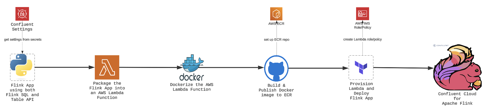
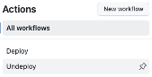

# Confluent Cloud for Apache Flink: Best Practices for Deploying Table API Applications with GitHub and Terraform

> _This is the first in our year-long “Best Practices in Action” series, where my team and I will share proven strategies for success._

**TL; DR:** _Deploy your Table API-based Flink App to Confluent Cloud for Apache Flink by packaging your code in an AWS Lambda Function and building a CI/CD pipeline with GitHub and Terraform._

From the moment [Confluent Cloud for Apache Flink (CCAF)](https://docs.confluent.io/cloud/current/flink/overview.html) entered Early Preview in late 2023, I was immediately captivated by its potential because I viewed it as a superior alternative to ksqlDB. Unlike ksqlDB, which is a derivative of SQL, Flink supports ANSI SQL 2011 and coupled with its ability for complex data transformation, allowed me to finally construct the data platform I had always envisioned!  Determined to leverage its capabilities, I integrated the [Confluent Terraform Provider](https://registry.terraform.io/providers/confluentinc/confluent/latest/docs) with GitHub to establish a robust CI/CD pipeline—enabling both my organization and our clients to benefit from dependable, managed Flink solutions.  By adhering to Confluent’s [recommendations](https://docs.confluent.io/cloud/current/flink/operate-and-deploy/deploy-flink-sql-statement.html) and [reference examples](https://github.com/confluentinc/terraform-provider-confluent/tree/master/examples/configurations), I quickly developed a Terraform-based workflow that automated the delivery of Flink SQL statements. However, when Confluent introduced [Table API](https://docs.confluent.io/cloud/current/flink/reference/table-api.html) support for Java and Python in mid-2024, it became evident that a completely new approach was required. With no established best practices for deploying Table API-based Flink applications within a CI/CD pipeline, I found myself navigating uncharted territory to ensure we could fully leverage this enhanced functionality.


After weighing the trade-offs of different strategies, I landed on the following best-practice approach for automating a CI/CD pipeline for CCAF:
1.	**Package the Code:** Build an AWS Lambda function (AWS is my hyperscaler of choice).
2.	**Dockerize:** Create a `Dockerfile` for the AWS Lambda function.
3.	**Set Up ECR:** Create an AWS Elastic Container Registry (ECR) to host Docker images.
4.	**Build & Publish:** From GitHub, build the Docker image and push it to AWS ECR.
5.	**Provision Lambda:** Use Terraform Cloud from GitHub to spin up the AWS Lambda function.
6.	**Deploy Flink App:** Invoke the AWS Lambda function (via Terraform) to deploy the Confluent Cloud for Apache Flink application.

The diagram below brings this entire deployment pipeline to life, showing how each component fits seamlessly together to deliver your Confluent Cloud for Apache Flink application:



## 1.0 Why This Approach

**Why did I choose the AWS Lambda service over hosting code in a docker container in the AWS Fargate container service, for example?**  While both services are powerful serverless compute options, each shines in different scenarios:

- AWS Lambda is ideal for _event-driven_, _short-lived_, and _stateless_ tasks.
- AWS Fargate excels in running _containerized_, _long-running_, and _stateful_ applications.

Since deploying a Flink application (a.k.a. Flink Job) to Confluent Cloud for Apache Flink (CCAF) is a short-lived task—specifically, it’s a **one-time** push that requires no persistent state—AWS Lambda clearly emerges as the best option in that scenario, IMHO.


**Why Dockerize the Lambda function?**  It’s a strategic choice when your code requires large, intricate dependencies—like the `confluent-flink-table-api-python-plugin`, which needs both Java and Python in one environment.  By packaging everything into a Docker container, you gain full control over your runtime, seamlessly manage custom dependencies, and streamline CI/CD pipelines for consistent, frictionless deployments.

**Why AWS ECR?**  As the native container registry in AWS, ECR delivers frictionless integration with AWS Lambda, ensuring secure, efficient storage and management of Docker images—all within the AWS ecosystem.

**Why Terraform Cloud?**  It unlocks the power of automated infrastructure provisioning, bringing Infrastructure as Code (IaC) principles to your AWS Lambda environment. This modern DevOps approach empowers you to build, deploy, and maintain resilient, scalable applications—all from a single source of truth in the Cloud.

## 2.0 Now See This Best Practice in Action
To illustrate this approach, I’m leveraging the [Apache Flink Kickstarter Flink App—powered by Python on Confluent Cloud for Apache Flink (CCAF)](https://github.com/j3-signalroom/apache_flink-kickstarter/tree/main/ccaf)—-as a prime example of the code you’d deploy to CCAF.  Now, let’s dive right in!  😉


### 2.1 Start with the Code

If you'd like to dive straight into the code, you can find the full implementation in my [GitHub repo](https://github.com/j3-signalroom/ccaf_kickstarter-flight_consolidator_app-lambda). Otherwise, buckly up, and I'll guide you through the code step-by-step as follows:

#### 2.1.1 This is a Python based Flink App

To get started, you’ll need to set up your Python virtual environment to run Python 3.11.x intepreter.  Why Python 3.11.x?  Well, the main Python package we will be using to write the Table API code is `confluent-flink-table-api-python-plugin`, and it runs on top of [`PyFlink 1.20.x`](https://nightlies.apache.org/flink/flink-docs-release-1.20/api/python/).  `PyFlink` upper limit [support for Python is 3.11.x](https://nightlies.apache.org/flink/flink-docs-release-1.20/docs/dev/python/installation/).

Ok then, now we got that cleared up, we need to tell Python what version to use and what packages to install.  We do this by creating two files in the root of the project directory: `pyproject.toml` and `.python-version`.  These files will tell Python what version to use and what packages to install.

##### 2.1.1.1 The `pyproject.toml` File
Our Flink App needs the following packages and dependencies:
- ```confluent-flink-table-api-python-plugin```, verion `1.20.42` or later -- this is the Python Table API plugin for Confluent Cloud for Apache Flink, which allows you to run Python code on Flink.
- ```boto3```, version `1.35.90` or later -- this is the AWS SDK for Python, which allows you to interact with AWS services.  The AWS Service the app interacts with is AWS Lambda, AWS Secrets Manager, and AWS Cloud Watch.
- ```setuptools```, version `65.5.1` or later -- allows you to install a package without copying any files to your interpreter directory (e.g. the `site-packages` directory).  This allows you to modify your source code and have the changes take effect without you having to rebuild and reinstall.  More importantly, it is a dependency of `confluent-flink-table-api-python-plugin`.

So, this is how `pyproject.toml` file looks like:
```python
[project]
name = "flight_consolidator_app"
version = "0.03.00.000"
description = "Confluent Cloud for Apache Flink (CCAF) Flight Consolidator App Lambda"
readme = "README.md"
authors = [
    { name = "Jeffrey Jonathan Jennings (J3)", email = "j3@thej3.com" }
]
requires-python = "~=3.11.9"
dependencies = [
    "boto3>=1.35.90",
    "confluent-flink-table-api-python-plugin>=1.20.42",
    "setuptools>=65.5.1",
]
```

Plus, you’ll need the Java 17 JDK installed to run the `confluent-flink-table-api-python-plugin`, because the packake calls Java JAR files from within it.

##### 2.1.1.2 The `.python-version` File
Finally, we need to tell Python what version to use.  So, this is how `.python-version` file looks like:

```text
3.11.9
```

##### 2.1.1.3 A Word on the Python Package Manager of Choice: [Astral's](https://astral.sh/) [`uv`](https://docs.astral.sh/uv/), that I use
Now, if you are new to my post on [LinkedIn](https://www.linkedin.com/in/jeffreyjonathanjennings/), [blogs](https://thej3.com/), or [GitHub projects](https://github.com/j3-signalroom), you don't know, but I am a total Fanboy of [Astral](https://astral.sh/)'s `uv` Python Package Manager.  You maybe asking yourself why.  Well, thank you for asking, `uv` is an incredibly fast Python package installer and dependency resolver, written in [**Rust**](https://github.blog/developer-skills/programming-languages-and-frameworks/why-rust-is-the-most-admired-language-among-developers/), and designed to seamlessly replace `pip`, `pipx`, `poetry`, `pyenv`, `twine`, `virtualenv`, and more in your workflows. By prefixing `uv run` to a command, you're ensuring that the command runs in an optimal Python environment **AUTOMATICALLY**.  😲 

Curious to learn more about [Astral's](https://astral.sh/) [`uv`](https://docs.astral.sh/uv/)? Check these out:
- Documentation: Learn about [`uv`](https://docs.astral.sh/uv/).
- Video: [`uv` IS THE FUTURE OF PYTHON PACKING!](https://www.youtube.com/watch?v=8UuW8o4bHbw)

#### 2.1.2 The `handler.py` Python Script File


I placed `handler.py` in the project’s root directory, skipping my usual Pythonic project file structure for simplicity.

What follows is a detail breakdown of the module:

##### 2.1.2.1 Import Statements
Starting at the top of the module, are the import statements needed:

```python
from pyflink.table import TableEnvironment, Schema, DataTypes, FormatDescriptor
from pyflink.table.catalog import ObjectPath
from pyflink.table.confluent import ConfluentTableDescriptor, ConfluentSettings, ConfluentTools
from pyflink.table.expressions import col, lit
import uuid
from functools import reduce
import boto3
from botocore.exceptions import ClientError
import json
import logging
```

##### 2.1.2.2 Constants
I love leveraging constants to keep code clear, maintainable, and future-proof.  So, below are the essential constants needed for the function in the module:

```python
# Confluent Cloud for Apache Flink Secrets Keys
ENVIRONMENT_ID = "environment.id"
FLINK_API_KEY = "flink.api.key"
FLINK_API_SECRET = "flink.api.secret"
FLINK_CLOUD = "flink.cloud"
FLINK_COMPUTE_POOL_ID = "flink.compute.pool.id"
FLINK_PRINCIPAL_ID = "flink.principal.id"
FLINK_REGION = "flink.region"
ORGANIZATION_ID = "organization.id"
```

##### 2.1.2.3 The AWS Lambda Handler Function
The AWS Lambda handler function is the main entry point for the Flink app.  Here is a quick summary of what the handler function does:  The function fetches from the AWS Secrets Manager the Confluent Cloud for Apache Flink settings (e.g., Flink Compute Pool API key, Compute Pool ID, etc.) which it uses to create a TableEnvironment to connect to the Confluent Cloud for Apache Flink.  Then it read data from two Kafka topics, combines the data, and writes the combined data to a Kafka sink topic.

Below is a step-by-step breakdown of the function:

**Step 1 of 10 - Function Signature**

The Lambda function serves as the entry point for your AWS Lambda application written in Python. It is a Python function that AWS Lambda invokes when your Lambda function is triggered.  So, to put it another way, as my mom 💜 would say (yes, she was a programmer back in the day!), this is when the Flink app’s life begins! 🚀

AWS Lambda rewquires at a minimum, a basic signature for the handler function, as shown below:

```python
def handler(event, context):
    """
    This AWS Lambda handler function is the main entry point for the Flink app.  This
    function fetches from the AWS Secrets Manager the Confluent Cloud for Apache Flink, 
    the settings (e.g., Flink Compute Pool API key, Compute Pool ID, etc.) to  create 
    a TableEnvironment with the Confluent Cloud for Apache Flink settings.  Then it
    read data from two Kafka topics, combines the data, and writes the combined data
    to a Kafka sink topic in which the Lambda function created.

    Args(s):
        event (Dict)           :  The event JSON object data, which contains data
                                  for the `statusCode`, and `body` attributes.
        context (LambdaContext):  The Lambda metadata that provides invocation, function, 
                                  and execution environment information.

    Returns:
        Dict:  A JSON object with a `statusCode` with a message in the `body`: 
            statusCode 200 for a successfully run of the function.
            statusCode 400 for a missing required field.
            statusCode 500 for a critical error.
    """
```

**Step 2 of 10 - Set up the logger**

Next, the code sets up a logger to log messages at the INFO level. The logger is used to log messages to the AWS CloudWatch Logs service, which is a centralized logging service provided by AWS:

```python
    # Set up the logger.
    logger = logging.getLogger()
    logger.setLevel(logging.INFO)
```

**Step 3 of 10 - Retrieve the `event` argument values**

Next, the code checks that all required fields for the event exist. If any of the required fields are missing, the code logs an error message and returns a JSON object with a status code of `400` and an error message in the body.  The `catalog_name` field contains the name of the Confluent Cloud for Apache Flink catalog (i.e., Confluent Cloud environment name), the `database_name` field contains the name of the database in the catalog (i.e., the Confluent Cloud Kafka Cluster where the Kafka topics reside), and the `ccaf_secrets_path` field contains the path to the Confluent Cloud for Apache Flink settings in AWS Secrets Manager:

```python
     # Check all required fields for the event exist.
    required_event_fields = ["catalog_name", "database_name", "ccaf_secrets_path"]
    for field in required_event_fields:
        if field not in event:
            logger.error(f"Missing required field: {field}")
            return {
                'statusCode': 400,
                'body': json.dumps({'error': f'Missing required field: {field}'})
            }

    # Get the required fields from the event.
    catalog_name = event["catalog_name"]
    database_name = event["database_name"]
    ccaf_secrets_path = event["ccaf_secrets_path"]
```

**Step 4 of 10 - Get the Confluent settings from the AWS Secrets Manager**

Next, the code gets the Confluent Cloud for Apache Flink settings from AWS Secrets Manager using the `ccaf_secrets_path` field. If the secrets are successfully retrieved, the code creates a TableEnvironment with the Confluent Cloud for Apache Flink settings. If the secrets cannot be retrieved, the code logs an error message and returns a JSON object with a status code of 500 and an error message in the body:

```python
    try:
        get_secret_value_response = boto3.client('secretsmanager').get_secret_value(SecretId=secrets_path)
        settings = json.loads(get_secret_value_response['SecretString'])

        # Create the TableEnvironment with the Confluent Cloud for Apache Flink settings.
        tbl_env = TableEnvironment.create(
            ConfluentSettings
                .new_builder()
                .set_cloud(settings[FLINK_CLOUD])
                .set_region(settings[FLINK_REGION])
                .set_flink_api_key(settings[FLINK_API_KEY])
                .set_flink_api_secret(settings[FLINK_API_SECRET])
                .set_organization_id(settings[ORGANIZATION_ID])
                .set_environment_id(settings[ENVIRONMENT_ID])
                .set_compute_pool_id(settings[FLINK_COMPUTE_POOL_ID])
                .set_principal_id(settings[FLINK_PRINCIPAL_ID])
                .build()
        )
    except ClientError as e:
        logger.error("Failed to get secrets from the AWS Secrets Manager because of %s.", e)
        return {
            'statusCode': 500,
            'body': json.dumps({'error': str(e)})
        }
```

> **Note:** _It is assumpted that you have already created the Confluent Cloud for Apache Flink secrets in AWS Secrets Manager when you ran the Terraform configuration you used in the [Apache Flink Kickstarter](https://github.com/j3-signalroom/apache_flink-kickstarter) Project.  If you have not, please follow the instructions in the [README](https://github.com/j3-signalroom/apache_flink-kickstarter/blob/main/README.md#20-lets-get-started)._

**Step 5 of 10 - Specify the Flink Catalog and Database**

Next, the code sets the current catalog and database in the TableEnvironment. The code then gets the catalog from the TableEnvironment using the `catalog_name` field:

```python
    # The catalog name and database name are used to set the current catalog and database.
    tbl_env.use_catalog(catalog_name)
    tbl_env.use_database(database_name)
    catalog = tbl_env.get_catalog(catalog_name)
```

**Step 6 of 10 - Create the Kafka Sink Topic**

Next, the code creates the Kafka sink table in the Confluent Cloud for Apache Flink catalog:

```python
    # The Kafka sink table Confluent Cloud environment Table Descriptor with Avro serialization.
    flight_avro_table_descriptor = (
        ConfluentTableDescriptor
            .for_managed()
            .schema(
                Schema
                    .new_builder()
                    .column("departure_airport_code", DataTypes.STRING())
                    .column("flight_number", DataTypes.STRING())
                    .column("email_address", DataTypes.STRING())
                    .column("departure_time", DataTypes.STRING())
                    .column("arrival_time", DataTypes.STRING())
                    .column("arrival_airport_code", DataTypes.STRING())
                    .column("confirmation_code", DataTypes.STRING())
                    .column("airline", DataTypes.STRING())
                    .build())
            .distributed_by_into_buckets(1, "departure_airport_code", "flight_number")
            .key_format(FormatDescriptor.for_format("avro-registry").build())
            .value_format(FormatDescriptor.for_format("avro-registry").build())
            .build()
    )
    try:
        # Checks if the table exists.  If it does not, it will be created.
        flight_avro_table_path = ObjectPath(tbl_env.get_current_database(), "flight_avro")
        if not catalog.table_exists(flight_avro_table_path):
            tbl_env.create_table(
                flight_avro_table_path.get_full_name(),
                flight_avro_table_descriptor
            )
            logger.info(f"Sink table '{flight_avro_table_path.get_full_name()}' created successfully.")
        else:
            logger.info(f"Sink table '{flight_avro_table_path.get_full_name()}' already exists.")
    except Exception as e:
        logger.error(f"A critical error occurred during the processing of the table because {e}")
        return {
            'statusCode': 500,
            'body': json.dumps({'error': str(e)})
        }
```

The sink table is created with an Avro serialization format. The sink table has eight columns: `departure_airport_code`, `flight_number`, `email_address`, `departure_time`, `arrival_time`, `arrival_airport_code`, `confirmation_code`, and `airline`. The sink table is distributed by `departure_airport_code` and `flight_number` into one bucket. The sink table has an Avro key format and an Avro value format.

**Step 7 of 10 - Query subset of fields from the `airline.skyone_avro` and `airline.sunset` Kafka Source Topics**

Next, the code gets the schema and columns from the airline table. The code then creates two tables: one for the SkyOne airline and one for the Sunset airline. The SkyOne table contains all columns from the airline table except for the excluded columns. The Sunset table contains all columns from the airline table except for the excluded columns:

```python
    # The first table is the SkyOne table that is read in.
    airline = tbl_env.from_path(f"{catalog_name}.{database_name}.skyone_avro")

    # Get the schema and columns from the airline table.
    schema = airline.get_schema()

    # The columns that are not needed in the table the represents general airline flight data.
    exclude_airline_columns = ["key", "flight_duration", "ticket_price", "aircraft", "booking_agency_email", "$rowtime"]
    
    # Get only the columns that are not in the excluded columns list.
    flight_expressions = [col(field) for field in schema.get_field_names() if field not in exclude_airline_columns]
    flight_columns = [field for field in schema.get_field_names() if field not in exclude_airline_columns]

    # The first table is the SkyOne table that is read in.
    skyone_airline = airline.select(*flight_expressions, lit("SkyOne"))

    # The second table is the Sunset table that is read in.
    sunset_airline = airline.select(*flight_expressions, lit("Sunset"))
```

> **Note:** _It is assumpted that you have already created and filled with records the `airline.skyone_avro` and `airline.sunset_avro` Kafka topics when you used with the [Apache Flink Kickstarter](https://github.com/j3-signalroom/apache_flink-kickstarter) Project.  If you have not, please follow the instructions in the [README](https://github.com/j3-signalroom/apache_flink-kickstarter/blob/main/java/README.md#21-avro-formatted-data)._

**Step 8 of 10 - Use functional programming to build a filter**

Next, the code constructs a filter condition that ensures all columns specified in the flight_columns list are not null.   This type of functional programming code is commonly used in data streaming frameworks like Apache Flink or Apache Spark to filter out records that contain null values in any of the specified columns:

```python
    # Build a compound expression, ensuring each column is not null
    filter_condition = reduce(
        lambda accumulated_columns, current_column: accumulated_columns & col(current_column).is_not_null, flight_columns[1:], col(flight_columns[0]).is_not_null
    )
```

The above code snippet demonstrates functional programming principles in Python. While it may not cover all aspects of functional programming, it effectively utilizes key constructs: 

- Utilizing higher-order functions (`reduce`).
- Employing `lambda` functions [not to be confused with AWS Lambda functions 😉] for concise, inline operations.
- Maintaining immutability by not altering the original data structures.
- Adopting a declarative approach to specify data transformations.

I highlight this code snippet to emphasize the importance of functional programming in data streaming frameworks like Apache Flink or Apache Spark. Functional programming is a powerful paradigm that can help you write more concise, readable, and maintainable code. By leveraging functional programming constructs, you can easily express complex data transformations and processing logic clearly and concisely. Moreover, it shows that with the Table API in CCAF, you can use your Python functional programming skills in Flink. This is an excellent way to leverage your existing Python skills and apply them to the world of data streaming and processing.

> _One of **my clients** wanted to know if this was possible to use normal Python programming with the Flink Table API, and I was able to demonstrate that one can.  So, now they know it and you know it!_  😊

**Step 9 of 10 - Union the two Kafka Source Topic tables**

Next, the code below combines the two tables, the SkyOne table and the Sunset table, into one table. The combined table is filtered using the filter condition to ensure that all columns specified in the flight_columns list are not null:

```python
    # Combine the two tables.
    combined_airlines = (
        skyone_airline.union_all(sunset_airline)
        .alias(*flight_columns, "airline")
        .filter(filter_condition)
    )
```

**Step 10 of 10 - Insert the rows of the union table into Kafka Sink Topic**

Finally, the code enables the insertion of the combined record into the sink table. If the records can be inserted successfully, the code logs a success message and returns a JSON object with a status code of `200` and the processed statement name in the success message in the body:

```python
    # Insert the combined record into the sink table.
    try:
        # Supply a friendly statement name to easily search for it only in the Confluent Web UI.
        # However, the name is required to be unique within environment and region, so a UUID is
        # added.
        statement_name = "combined-flight-data-" + str(uuid.uuid4())
        tbl_env.get_config().set("client.statement-name", statement_name)

        # Execute the insert statement.
        table_result = combined_airlines.execute_insert(flight_avro_table_path.get_full_name())

        # Get the processed statement name.
        processed_statement_name = ConfluentTools.get_statement_name(table_result)
        success_message = f"Data processed and inserted successfully as: {processed_statement_name}"
        logger.info(success_message)
        return {
            'statusCode': 200,
            'body': json.dumps({'message': success_message})
        }
    except Exception as e:
        logger.error(f"An error occurred during data insertion: {e}")
        return {
            'statusCode': 500,
            'body': json.dumps({'error': str(e)})
        }
```

#### 2.1.3 The `Dockerfile` File
The `Dockerfile` is a text file that contains a series of commands that are executed by the Docker daemon to build a Docker image.  The `public.ecr.aws/lambda/python:3.11.2024.11.22.15` Docker image is the official AWS-provided base image specifically designed for creating container-based AWS Lambda functions using Python.  Also, this Dockerfile installs the Java 17 JDK, sets the JAVA_HOME environment variable, installs the required Python packages, copies the handler.py Python script to the Lambda function directory, and then sets the handler for the Lambda function.

So, this is how `Dockerfile` file looks like:

```dockerfile
FROM public.ecr.aws/lambda/python:3.11.2024.11.22.15

# Install Java 17
RUN yum clean all && \
    yum -y update && \
    yum -y install java-17-amazon-corretto-devel && \
    yum clean all

# Container metadata
LABEL maintainer=j3@thej3.com \
      description="Apache Flink Kickstarter Project, showcasing Confluent Clound for Apache Flink"

# Set JAVA_HOME
ENV JAVA_HOME=/usr/lib/jvm/java-17-amazon-corretto
ENV PATH=$JAVA_HOME/bin:$PATH

# Install Confluent Cloud for Apache Flink and other dependencies
COPY requirements.txt .
RUN pip install --upgrade pip
RUN pip install -r requirements.txt

# Copy the application code
COPY handler.py ${LAMBDA_TASK_ROOT}

# Set the handler
CMD ["handler.lambda_handler"]
```

#### 2.1.4 The `requirements.txt` File
The `requirements.txt` file contains a list of Python packages that are required by the AWS Lambda function.

So, this is how `requirements.txt` file looks like:

```text
boto3>=1.35.90
confluent-flink-table-api-python-plugin>=1.20.42
setuptools>=65.5.1
lxml==4.9.2
```

## 2.2 GitHub: The CI/CD Pipeline


GitHub Actions is a powerful, flexible CI/CD service that allows you to automate your software development workflows.  In this section, we’ll walk through the GitHub Actions workflow that builds the Docker image and pushes it to AWS ECR, and then deploys the AWS Lambda function using Terraform Cloud.

The GitHub Actions workflow is organized into one workflow file, `.github/workflows/deploy.yml` configuration file and one action file, `.github/actions/aws-environment-info.yml` configuration file.

### 2.2.1 The `.github/workflows/deploy.yml` GitHub Actions Workflow File

The `deploy.yml` GitHub Actions workflow file is the central configuration file that orchestrates the overall pipeline and decides when and in what sequence actions or steps should run.  For this repo, the GitHub Actions workflow builds the Docker image and pushes it to AWS ECR, and initializes, plans and applys the Terraform project.

Below is a step-by-step breakdown of the worflow configuration file:

**Step 1 of 5 - Name the workflow**

The configuration file starts with the `name` field, which labels the workflow, making it easy to identify in the GitHub Actions tab:



Then the configuration sets the permission for the workflow to fetch source code and issue OpenID Connect (OIDC) tokens (`id-token: write`) needed for assuming AWS IAM roles securely, and read the contents of the repository (`contents: read`):

```yaml
name: Deploy

permissions:
  id-token: write   # This is required for requesting the JWT
  contents: read    # This is required for actions/checkout  
```

**Step 2 of 5 - Trigger the workflow**

Next, the configuration file specifies the workflow will be triggered manually from the GitHub UI:


```yaml
on:
  workflow_dispatch:
    inputs:
      aws_environment:
        type: choice
        description: AWS Environment
        required: true
        default: dev
        options:
          - dev
          - test
          - prod
      aws_region:
        type: choice
        description: AWS Region
        required: true
        default: us-east-1
        options:
          - us-east-1
          - us-east-2
          - us-west-1
          - us-west-2
      ccaf_secrets_path:
        type: string
        description: CCAF Secrets Path
        required: true
      catalog_name:
        type: string
        description: Catalog Name
        required: true
      database_name:
        type: string
        description: Database Name
        required: true
```

The GitHub UI collects the following parameters for the deployment:
- `aws_environment`:   The AWS environment name (e.g., dev, test, prod), where each environment is mapped to a specific AWS account.
- `aws_region`:        The AWS region where the AWS resources will be deployed.
- `ccaf_secrets_path`: The path to the Confluent Cloud for Apache Flink settings in AWS Secrets Manager.
- `catalog_name`:      The name of the Confluent Cloud for Apache Flink catalog.
- `database_name`:     The name of the database in the catalog.

**Step 3 of 5 - Set Run Name**

Next, the configuration file dynamically generates a run name to indicate which branch is deploying to which AWS environment and region:

```yaml
run-name: ${{ github.workflow }} ${{ github.ref_name }} branch to the ${{ github.event.inputs.aws_region }} ${{ github.event.inputs.aws_environment }} environment
```

**Step 4 of 5 - AWS Lambda Publish Job**

Next, the configuration file defines the `lambda-publish` job, which builds the Docker image and pushes it to Amazon ECR:

```yaml
jobs:
  lambda-publish:
    name: "Create, build, tag and push docker image to Amazon ECR"
    runs-on: ${{ github.event.inputs.aws_environment }}
    steps:
      - name: Checkout code
        uses: actions/checkout@v4

      - name: Get AWS Environment Info
        id: aws-environment-info
        uses: ./.github/actions/aws-environment-info
        with:
          aws_environment: ${{ github.event.inputs.aws_environment }}
          aws_dev_account_id: ${{ vars.AWS_DEV_ACCOUNT_ID }}
          aws_test_account_id: ${{ vars.AWS_TEST_ACCOUNT_ID }}
          aws_prod_account_id: ${{ vars.AWS_PROD_ACCOUNT_ID }}
          aws_region: ${{ github.event.inputs.aws_region }}

      - name: Configure AWS credentials
        id: aws-credentials
        uses: aws-actions/configure-aws-credentials@v4
        with:
          role-to-assume: arn:aws:iam::${{ steps.aws-environment-info.outputs.aws_account_id }}:role/GitHubActionsRole
          aws-region: ${{ github.event.inputs.aws_region }}
          output-credentials: true

      - name: Login to Amazon ECR
        id: login-ecr
        uses: aws-actions/amazon-ecr-login@v2

      - name: Build, tag, and push docker image to Amazon ECR
        env:
          REGISTRY: ${{ steps.login-ecr.outputs.registry }}
          REPOSITORY: "ccaf_kickstarter-flight_consolidator_app"
          IMAGE_TAG: ${{ github.sha }}
        run: |
          docker build -t $REGISTRY/$REPOSITORY:$IMAGE_TAG .
          docker push $REGISTRY/$REPOSITORY:$IMAGE_TAG
```

**Step 5 of 5 - Terraform Initialize, Plan and Apply Job**

Finally, the configuration file defines the `terraform-init-plan-apply` job, which initializes, plans, and applies the Terraform project:

```yaml
  terraform-init-plan-apply:
    needs: lambda-publish
    runs-on: ${{ github.event.inputs.aws_environment }}
    steps:
      - name: Get AWS Environment Info
        id: aws-environment-info
        uses: ./.github/actions/aws-environment-info
        with:
          aws_environment: ${{ github.event.inputs.aws_environment }}
          aws_dev_account_id: ${{ vars.AWS_DEV_ACCOUNT_ID }}
          aws_test_account_id: ${{ vars.AWS_TEST_ACCOUNT_ID }}
          aws_prod_account_id: ${{ vars.AWS_PROD_ACCOUNT_ID }}
          aws_region: ${{ github.event.inputs.aws_region }}

      - name: Configure AWS credentials
        id: aws-credentials
        uses: aws-actions/configure-aws-credentials@v4
        with:
          role-to-assume: arn:aws:iam::${{ steps.aws-environment-info.outputs.aws_account_id }}:role/GitHubActionsRole
          aws-region: ${{ github.event.inputs.aws_region }}
          output-credentials: true
          
      - name: Terraform Init
        id: init
        run:  terraform init
  
      - name: Terraform Validate
        id: validate
        run: terraform validate -no-color

      - name: Terraform Plan
        id: plan
        run: terraform plan
        env:
          TF_VAR_aws_account_id: ${{ steps.aws-environment-info.outputs.aws_account_id }}
          TF_VAR_aws_region: ${{ github.event.inputs.aws_region }}
          TF_VAR_aws_access_key_id: ${{ steps.aws-credentials.outputs.aws-access-key-id }}
          TF_VAR_aws_secret_access_key: ${{ steps.aws-credentials.outputs.aws-secret-access-key }}
          TF_VAR_aws_session_token: ${{ steps.aws-credentials.outputs.aws-session-token }}
          TF_VAR_ccaf_secrets_path: ${{ github.event.inputs.ccaf_secrets_path }}
          TF_VAR_catalog_name: ${{ github.event.inputs.catalog_name }}
          TF_VAR_database_name: ${{ github.event.inputs.database_name }}

      - name: Terraform Apply
        id: apply
        run: terraform apply -auto-approve
        env:
          TF_VAR_aws_account_id: ${{ steps.aws-environment-info.outputs.aws_account_id }}
          TF_VAR_aws_region: ${{ github.event.inputs.aws_region }}
          TF_VAR_aws_access_key_id: ${{ steps.aws-credentials.outputs.aws-access-key-id }}
          TF_VAR_aws_secret_access_key: ${{ steps.aws-credentials.outputs.aws-secret-access-key }}
          TF_VAR_aws_session_token: ${{ steps.aws-credentials.outputs.aws-session-token }}
          TF_VAR_ccaf_secrets_path: ${{ github.event.inputs.ccaf_secrets_path }}
          TF_VAR_catalog_name: ${{ github.event.inputs.catalog_name }}
          TF_VAR_database_name: ${{ github.event.inputs.database_name }}
```

### 2.2.2 The `.github/actions/aws-environment-info.yml` GitHub Actions Action File
The `aws-environment-info.yml` GitHub Actions action file packages up reusable functionality (with inputs, outputs, and scripts) that can be plugged into one or more workflows.  For this repo, the GitHub Actions action file retrieves the AWS account ID and AWS region from the AWS environment variables.  The action is called by the `deploy.yml` GitHub Actions workflow file in the `lambda-publish` and `terraform-init-plan-apply` jobs.

Below is a step-by-step breakdown of the action:

**Step 1 of 3 - Action Metadata**

The action file specifies the metadata for the action:

```yaml
name: "AWS Environment Info"
description: 'Based on the input of the environment type, the relevant environmental information is provided as output.'
author: 'Jeffrey Jonathan Jennings (J3)'
```

- name: The display name of this composite action, which will appear in logs and references (uses: ./.github/actions/aws-environment-info).
- description: Explains that it sets environment variables (particularly the AWS Account ID) based on which environment (dev, test, prod) was selected.
- author: Credited as “Jeffrey Jonathan Jennings (J3).”

**Step 2 of 3 - Input & Output**

The action configuration file specifies the input and output parameters for the action:

```yaml
inputs:
  aws_environment:
    required: true
    description: 'The AWS Environment'
  aws_dev_account_id:
    required: true
    description: 'The AWS Dev Account ID'
  aws_test_account_id:
    required: true
    description: 'The AWS Test Account ID'
  aws_prod_account_id:
    required: true
    description: 'The AWS Prod Account ID'
  aws_region:
    required: true
outputs:
  aws_account_id:
    value: ${{ steps.workflow-inputs-output.outputs.AWS_ACCOUNT_ID }}
```

**Step 3 of 3 - Action Execution**

The action configuration file based on the input of the environment type, the relevant AWS Account ID is provided as output:

```yaml
runs:
  using: composite
  steps:
    - if: inputs.aws_environment == 'dev'
      name: dev-environment
      shell: bash
      working-directory: ./.github/
      run: echo "AWS_ACCOUNT_ID=${{ inputs.aws_dev_account_id }}" >> $GITHUB_ENV

    - if: inputs.aws_environment == 'test'
      name: test-environment
      shell: bash
      working-directory: ./.github/
      run: echo "AWS_ACCOUNT_ID=${{ inputs.aws_test_account_id }}" >> $GITHUB_ENV

    - if: inputs.aws_environment == 'prod'
      name: prod-environment
      shell: bash
      working-directory: ./.github/
      run: echo "AWS_ACCOUNT_ID=${{ inputs.aws_prod_account_id }}" >> $GITHUB_ENV

    - name: "Display Workflow Inputs"
      shell: bash
      working-directory: ./.github/
      id: workflow-inputs-output
      run: |
        echo "AWS_ACCOUNT_ID=${{ env.AWS_ACCOUNT_ID }}" >> $GITHUB_OUTPUT
        echo "### Workflow Inputs" >> $GITHUB_STEP_SUMMARY
        echo `date` >> $GITHUB_STEP_SUMMARY
        echo "" >> $GITHUB_STEP_SUMMARY
        echo "aws_environment  : ${{ inputs.aws_environment }}" >> $GITHUB_STEP_SUMMARY
        echo "aws_account_id   : ${{ env.AWS_ACCOUNT_ID }}" >> $GITHUB_STEP_SUMMARY        
        echo "aws_region       : ${{ inputs.aws_region }}" >> $GITHUB_STEP_SUMMARY
```

## 2.3 The Terraform Project
Terraform is a powerful tool for automating infrastructure provisioning and management.  In this section, we’ll walk through the Terraform project that provisions the AWS Lambda function and deploys the Confluent Cloud for Apache Flink app.


> **Note:**  _I use Terraform Cloud, a comprehensive, managed cloud service provided by HashiCorp that enhances the capabilities of Terraform for Infrastructure as Code (IaC). It offers a suite of features designed to streamline, secure, and optimize the process of provisioning and managing infrastructure across various environments._

Our Terraform project is organized into four configuration files:
- ```main.tf```: The primary Terraform configuration file that sets the Terraform cloud settings and define the local variables that will be used throughout the project defines the AWS Lambda function and the required resources.
- ```variables.tf```: The Terraform variables file that defines the input variables used in the Terraform project.
- ```provider.tf```: The Terraform provider file that defines the AWS provider configuration.
- ```aws-lambda-setup.tf```: The Terraform file that defines the AWS Lambda function and the required resources.

### 2.3.1 The ```main.tf``` Terraform Configuration File
The `main.tf` file is the central Terraform configuration file in our Terraform project.  It is the entry point where we:
- Define High-Level Resources
- Reference Variables and Modules (if any)
- Orchestrate Dependencies

In this project, we define the Terraform cloud settings, local variables which references variables from the `variables.tf` configuration file, and the AWS provider configuration.

So, this is how `main.tf` Terraform configuration file looks like:

```hcl
terraform {
    cloud {
      organization = "signalroom"

        workspaces {
            name = "ccaf-kickstarter-flight-consolidator-app"
        }
  }

  required_providers {
        aws = {
            source  = "hashicorp/aws"
            version = "~> 5.82.2"
        }
    }
}

locals {
    # Repo name and URIs
    repo_name    = "ccaf_kickstarter-flight_consolidator_app"
    repo_uri     = "${var.aws_account_id}.dkr.ecr.${var.aws_region}.amazonaws.com/${local.repo_name}:latest"
    ecr_repo_uri = "arn:aws:ecr:${var.aws_region}:${var.aws_account_id}:repository/${local.repo_name}"
}
```

The key components of the `main.tf` Terraform configuration file are as follows:
- **cloud** block: Configures Terraform to use Terraform Cloud, specifying the `organization` (`signalroom`) and the `workspace` (`ccaf-kickstarter-flight-consolidator-app`).

    > **Note:** _You need to change the `organization` to the organization name defined in your Terraform Cloud account._

- **required_providers** block: Declares the AWS provider from the HashiCorp registry, pinning it to version `~> 5.82.2`.
- **local** block: Defines local variables that are used throughout the Terraform configuration. 
   * **repo_name**: Defines a short, descriptive name for the Docker image repository in AWS ECR.  
   * **repo_uri**: Constructs the full URI (account + region + repository name + `:latest` tag) for pushing/pulling Docker images.  
   * **ecr_repo_uri**: Defines the Amazon Resource Name (ARN) of the ECR repository, used by other Terraform resources that need to reference the repository.

### 2.3.2 The `variables.tf` Terraform Configuration File
The `variables.tf` file defines the input variables used in the Terraform project.  Each variable includes descriptions and validation rules, helping ensure your AWS Lambda function and CCAF environment are configured correctly while preventing invalid or unsupported settings.

So, this is how `variables.tf` Terraform configuration file looks like:

```hcl
variable "aws_region" {
    description = "The AWS Region."
    type        = string
}

variable "aws_account_id" {
    description = "The AWS Account ID."
    type        = string
}

variable "aws_access_key_id" {
    description = "The AWS Access Key ID."
    type        = string
    default     = ""
}

variable "aws_secret_access_key" {
    description = "The AWS Secret Access Key."
    type        = string
    default     = ""
}

variable "aws_session_token" {
    description = "The AWS Session Token."
    type        = string
    default     = ""
}

variable "catalog_name" {
    description = "The CCAF Catalog Name."
    type        = string
    default     = ""
}

variable "database_name" {
    description = "The CCAF Database Name."
    type        = string
    default     = ""
}

variable "ccaf_secrets_path" {
    description = "The CCAF AWS Secrets Manager secrets path."
    type        = string
}

variable "aws_lambda_memory_size" {
    description = "AWS Lambda allocates CPU power in proportion to the amount of memory configured. Memory is the amount of memory available to your Lambda function at runtime. You can increase or decrease the memory and CPU power allocated to your function using the Memory setting. You can configure memory between 128 MB and 10,240 MB in 1-MB increments. At 1,769 MB, a function has the equivalent of one vCPU (one vCPU-second of credits per second)."
    type = number
    default = 128
    
    validation {
        condition = var.aws_lambda_memory_size >= 128 && var.aws_lambda_memory_size <= 10240
        error_message = "AWS Lambda memory size, `aws_lambda_memory_size`, must be 1 up to a maximum value of 10,240."
    }
}

variable "aws_lambda_timeout" {
    description = "AWS Lambda runs your code for a set amount of time before timing out. Timeout is the maximum amount of time in seconds that a Lambda function can run. The default value for this setting is 900 seconds, but you can adjust this in increments of 1 second up to a maximum value of 900 seconds (15 minutes)."
    type = number
    default = 900
    
    validation {
        condition = var.aws_lambda_timeout >= 1 && var.aws_lambda_timeout <= 900
        error_message = "AWS Lambda timeout, `aws_lambda_timeout`, must be 1 up to a maximum value of 900."
    }
}

variable "aws_log_retention_in_days" {
    description = "Specifies the number of days you want to retain log events in the specified log group. Possible values are: 1, 3, 5, 7, 14, 30, 60, 90, 120, 150, 180, 365, 400, 545, 731, 1096, 1827, 2192, 2557, 2922, 3288, 3653, and 0. If you select 0, the events in the log group are always retained and never expire."
    type = number
    default = 7

    validation {
        condition = contains([1, 3, 5, 7, 14, 30, 60, 90, 120, 150, 180, 365, 400, 545, 731, 1096, 1827, 2192, 2557, 2922, 3288, 3653, 0], var.aws_log_retention_in_days)
        error_message = "AWS Log Retention in Days, `aws_log_retention_in_days`, must be 1 up to a maximum value of 900."
    }
}
```

### 2.3.3 The `provider.tf` Terraform Configuration File
The `provider.tf` file defines the AWS provider configuration used by Terraform to authenticate with AWS and target the specified region for resource creation.

So, this is how `provider.tf` Terraform configuration file looks like:

```hcl
provider "aws" {
    region     = var.aws_region
    access_key = var.aws_access_key_id
    secret_key = var.aws_secret_access_key
    token      = var.aws_session_token
}
```

### 2.3.4 The `aws-lambda-setup.tf` Terraform Configuration File
The `aws-lambda-setup.tf` file defines the AWS Lambda function and the required resources for deploying the Confluent Cloud for Apache Flink app.

Below is a step-by-step breakdown of the `aws-lambda-setup.tf` Terraform Configuration File:

**Step 1 of 6 - Get IAM Role & Assume Role Policy**

The configuration generates an IAM policy document in JSON format for AWS Lambda Service, creates an IAM role that Lambda can assume (IAM polcy document does this), and then granting the necessary trust relationship:

```hcl
data "aws_iam_policy_document" "assume_role" {
    statement {
    effect = "Allow"
    principals {
        type        = "Service"
        identifiers = ["lambda.amazonaws.com"]
    }
    actions = ["sts:AssumeRole"]
    }
}

resource "aws_iam_role" "flight_consolidator_lambda" {
    name               = "ccaf_flight_consolidator_app_role"
    assume_role_policy = data.aws_iam_policy_document.assume_role.json
}
```

**Step 2 of 6 - Secrets Manager & Custom Policy**

Next, the configuration fetches the specified Secrets Manager resource and builds a policy allowing AWS Lambda to create logs, pull images from AWS ECR, and retrieve secrets from AWS Secrets Manager:

```hcl
data "aws_secretsmanager_secret" "ccaf_secrets_path" {
    name = var.ccaf_secrets_path
}

resource "aws_iam_policy" "flight_consolidator_lambda_policy" {
    name        = "ccaf_flight_consolidator_app_policy"
    description = "IAM policy for the flight_consolidator Lambda execution role."

    policy = jsonencode({
        Version = "2012-10-17",
        Statement = [
        {
            Action = [
            "logs:CreateLogGroup",
            "logs:CreateLogStream",
            "logs:PutLogEvents"
            ],
            Effect   = "Allow",
            Resource = "arn:aws:logs:*:*:*"
        },
        {
            Action = [
            "ecr:GetDownloadUrlForLayer",
            "ecr:BatchGetImage",
            "ecr:BatchCheckLayerAvailability"
            ],
            Effect   = "Allow",
            Resource = local.ecr_repo_uri
        },
        {
            Action = "ecr:GetAuthorizationToken",
            Effect = "Allow",
            Resource = "*"
        },
        {
            Action = [
            "secretsmanager:GetSecretValue"
            ],
            Effect = "Allow",
            Resource = [
            data.aws_secretsmanager_secret.ccaf_secrets_path.arn
            ]
        }
        ]
    })
}
```

**Step 3 of 6 - Role-Policy Attachment**

Next, the configuration binds the custom policy to the AWS Lambda role so the function can perform the permitted actions:

```hcl
# Attach the policy to the role
resource "aws_iam_role_policy_attachment" "flight_consolidator_lambda_policy_attachment" {
    role       = aws_iam_role.flight_consolidator_lambda.name
    policy_arn = aws_iam_policy.flight_consolidator_lambda_policy.arn

    depends_on = [ 
        aws_iam_role.flight_consolidator_lambda,
        aws_iam_policy.flight_consolidator_lambda_policy 
    ]
}
```

**Step 4 of 6 - AWS Lambda Function Creation**

Next, the configuration defines the Lambda function, using `package_type = "Image"` to pull the container image from AWS ECR.  It configures memory, timeout, and role—forming the core of your deployment:

```hcl
resource "aws_lambda_function" "flight_consolidator_lambda_function" {
    function_name = "ccaf_flight_consolidator_app_function"
    role          = aws_iam_role.flight_consolidator_lambda.arn
    package_type  = "Image"
    image_uri     = local.repo_uri
    memory_size   = var.aws_lambda_memory_size
    timeout       = var.aws_lambda_timeout

    depends_on = [ 
        aws_iam_role.flight_consolidator_lambda 
    ]
}
```

**Step 5 of 6 - CloudWatch Log Group**

Next, the configuration establishes a dedicated log group with a chosen retention policy for AWS Lambda’s outputs:

```hcl
# Create a CloudWatch log group for the Lambda function
resource "aws_cloudwatch_log_group" "flight_consolidator_lambda_function_log_group" {
    name              = "/aws/lambda/${aws_lambda_function.flight_consolidator_lambda_function.function_name}"
    retention_in_days = var.aws_log_retention_in_days
}

**Step 6 of 6 - Lambda Invocation**

Finally, the configuration triggers the Lambda function with a JSON payload containing the specified parameters:

```hcl
# Lambda function invocation
resource "aws_lambda_invocation" "flight_consolidator_lambda_function" {
    function_name = aws_lambda_function.flight_consolidator_lambda_function.function_name

    input = jsonencode({
        catalog_name      = var.catalog_name
        database_name     = var.database_name
        ccaf_secrets_path = var.ccaf_secrets_path
    })

    depends_on = [ 
        aws_iam_policy.flight_consolidator_lambda_policy,
        aws_lambda_function.flight_consolidator_lambda_function
    ]
}
```

By combining these resources—roles, policies, logs, and function invocations—you create a **secure, robust** pipeline for deploying your Confluent Cloud for Apache Flink app via AWS Lambda.

## 3.0 Conclusion
We’ve explored the entire journey of **DEPLOYING** a Confluent Cloud for Apache Flink app via AWS Lambda—from designing the Lambda function and crafting the Dockerfile to setting up a GitHub CI/CD pipeline and Terraform infrastructure. By following these best practices, you’ll be able to streamline development, ensure consistent deployments, and fully harness Confluent Cloud’s real-time data processing power. Now, you’re equipped to take your serverless and event-driven workflows to new heights.

For a recap of the deployment process, refer to the architectural drawing below:


The numbers correspond to the sections in this blog post:

1. [2.2 GitHub: The CI/CD Pipeline](#22-github-the-cicd-pipeline)
2. [2.1.2 The ```handler.py``` Python Script File](#212-the-handlerpy-python-script-file)
3. [2.1.3 The ```Dockerfile``` File](#213-the-dockerfile-file)
4. [2.3 The Terraform Project](#23-the-terraform-project)

## 4.0 Resources
[Create a Lambda function using a container image](https://docs.aws.amazon.com/lambda/latest/dg/images-create.html)

[Apache Flink Kickstarter](https://github.com/j3-signalroom/apache_flink-kickstarter)

[Confluent Cloud for Apache Flink](https://docs.confluent.io/cloud/current/flink/overview.html)

[Flink Applications Powered by Python on Confluent Cloud for Apache Flink (CCAF)](https://github.com/j3-signalroom/apache_flink-kickstarter/blob/main/ccaf/README.md)

[Confluent Cloud for Apache Flink (CCAF) Flight Consolidator App Lambda](https://github.com/j3-signalroom/ccaf_kickstarter-flight_consolidator_app-lambda)
