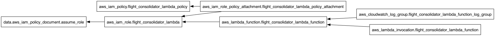
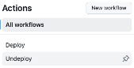
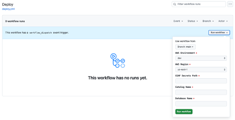

# Confluent Cloud for Apache Flink (CCAF) Flight Consolidator App Lambda
This repository empowers the deployment of a robust [Flink Job Graph](https://github.com/j3-signalroom/j3-techstack-lexicon/blob/main/apache-flink-glossary.md#jobgraph) to [Confluent Cloud for Apache Flink (CCAF)](https://docs.confluent.io/cloud/current/flink/overview.html) , enabling seamless and continuous real-time streaming. The [Flink Job Graph](https://github.com/j3-signalroom/j3-techstack-lexicon/blob/main/apache-flink-glossary.md#jobgraph) meticulously ingests flight data from the `airline.sunset_avro` and `airline.skyone_avro` Kafka topics, standardizing and unifying the information into a single, consolidated `airline.flight_avro` Kafka topic. By leveraging advanced stream processing capabilities, this deployment ensures high scalability, data consistency, and reliability, providing organizations with a powerful foundation for actionable flight analytics and insightful decision-making.

---

**Table of Contents**

<!-- toc -->
+ [1.0 **Let's get started!**](#10-lets-get-started)
    * [1.1 **Use the local Bash scripts supplied in the repo to deploy the Lambda function**](#11-use-the-local-bash-scripts-supplied-in-the-repo-to-deploy-the-lambda-function)
        - [1.1.1 **Take care of the cloud and local environment prequisities listed below:**](#111-take-care-of-the-cloud-and-local-environment-prequisities-listed-below)
        - [1.1.2 **Clone the repo:**](#112-clone-the-repo)
        - [1.1.3 **Navigate to the Root Directory:**](#113-navigate-to-the-root-directory)
        - [1.1.4 **Run the Script to Publish (Create) or Unpublish (Delete) the ECR Repository:**](#114-run-the-script-to-publish-create-or-unpublish-delete-the-ecr-repository)
        - [1.1.5 **Run the Script to Create or Destroy the Terraform Configuration:**](#115-run-the-script-to-create-or-destroy-the-terraform-configuration)
            * [1.1.5.1 **Visualizing the Terraform Configuration**](#1151-visualizing-the-terraform-configuration)
    * [1.2. **Deploy the Lambda function from cloud using GitHub**](#12-deploy-the-lambda-function-from-cloud-using-github)
        - [1.2.1 **Deploy the Repository:**](#121-deploy-the-repository)
        - [1.2.2 **Set Required Secrets and Variables:**](#122-set-required-secrets-and-variables)
        - [1.2.3 **Navigate to the Actions Page:**](#123-navigate-to-the-actions-page)
        - [1.2.4 **Select and Run the Deploy Workflow:**](#124-select-and-run-the-deploy-workflow)
<!-- tocstop -->

---

> _Please run the [**`AvroDataGeneratorApp`**](https://github.com/j3-signalroom/apache_flink-kickstarter/blob/main/java/README.md) first to generate the `airline.sunset_avro` and `airline.skyone_avro` Kafka topics before running this application._

---

## 1.0 **Let's get started!**

### 1.1 **Use the local Bash scripts supplied in the repo to deploy the Lambda function**

#### 1.1.1 **Take care of the cloud and local environment prequisities listed below:**
    > You need to have the following cloud accounts:
    > - [AWS Account](https://signin.aws.amazon.com/) *with SSO configured*
    >  [`aws2-wrap` utility](https://pypi.org/project/aws2-wrap/#description)

    > You need to have the following installed on your local machine:
    > - [AWS CLI version 2](https://docs.aws.amazon.com/cli/latest/userguide/getting-started-install.html)

#### 1.1.2 **Clone the repo:**
```bash
git clone https://github.com/j3-signalroom/ccaf_kickstarter-flight_consolidator_app-lambda.git
```

#### 1.1.3 **Navigate to the Root Directory:**
Open your Terminal and navigate to the root folder of the `ccaf_kickstarter-flight_consolidator_app-lambda/` repository that you have cloned. You can do this by executing:

```bash
cd path/to/ccaf_kickstarter-flight_consolidator_app-lambda/
```

   Replace `path/to/` with the actual path where your repository is located.

#### 1.1.4 **Run the Script to Publish (Create) or Unpublish (Delete) the ECR Repository:**
Execute the `build-publish-lambda.sh` script to create an AWS Elastic Container Registry (ECR) repository, build the AWS Lambda Docker container, and publish it to the newly created ECR repository. This will make the container image available for future deployments.

Use the following command format:

```bash
scripts/build-publish-lambda.sh <create | delete> --profile=<SSO_PROFILE_NAME>
```

**Replace Argument Placeholders:**
   - `<create | delete>`: Specify either `create` to create the ECR repository or `delete` to remove it.
   - `<SSO_PROFILE_NAME>`: Replace this with your AWS Single Sign-On (SSO) profile name, which identifies your hosted AWS infrastructure.

For example, to create the ECR repository, use the following command:
```bash
scripts/build-publish-lambda.sh create --profile=my-aws-sso-profile
```
Replace `my-aws-sso-profile` with your actual AWS SSO profile name.

#### 1.1.5 **Run the Script to Create or Destroy the Terraform Configuration:**
Execute the `run-terraform-locally.sh` script to create the IAM Policy and Role for the Lambda, and then invoke (run) the Lambda.

Use the following command format:

```bash
scripts/run-terraform-locally.sh <create | delete> --profile=<SSO_PROFILE_NAME> --catalog-name=<CATALOG_NAME> --database-name=<DATABASE_NAME> --ccaf-secrets-path=<CCAF_SECRETS_PATH>
```

**Replace Argument Placeholders:**
   - `<create | delete>`: Specify either `create` to create the ECR repository or `delete` to remove it.
   - `<SSO_PROFILE_NAME>`: Replace this with your AWS Single Sign-On (SSO) profile name, which identifies your hosted AWS infrastructure.
   - `<CATALOG_NAME>`: Replace this with the name of your Flink catalog.
   - `<DATABASE_NAME>`: Replace this with the name of your Flink database.
   - `<CCAF_SECRETS_PATH>`: Replace this with the path to the Confluent Cloud for Apache Flink (CCAF) AWS Secrets Manager secrets.

For example, to create the IAM Policy and Role for the Lambda, and then invoke (run) the Lambda, use the following command:
```bash
scripts/run-terraform-locally.sh create --profile=my-aws-sso-profile --catalog-name=flink_kickstarter --database-name=flink_kickstarter --ccaf-secrets-path="/confluent_cloud_resource/flink_kickstarter/flink_compute_pool"
```

Replace `my-aws-sso-profile` with your actual AWS SSO profile name, `flink_kickstart` Flink catalog (Environment), `flink_kickstart` Flink database (Kafka Cluster) and the `/confluent_cloud_resource/flink_kickstarter/flink_compute_pool` AWS Secrets Manager secrets path.

##### 1.1.5.1 **Visualizing the Terraform Configuration**
Below is the Terraform visualization of the Terraform configuration.  It shows the resources and their dependencies, making the infrastructure setup easier to understand.



> _To fully view the image, open it in another tab on your browser to zoom in._

---

### 1.2. **Deploy the Lambda function from cloud using GitHub**

#### 1.2.1 **Deploy the Repository:** 
Ensure that you have cloned or forked the repository to your GitHub account.

#### 1.2.2 **Set Required Secrets and Variables:**
Before running any of the GitHub workflows provided in the repository, you must define at least the `AWS_DEV_ACCOUNT_ID` variable (which should contain your AWS Account ID for your development environment). To do this:

- Go to the Settings of your cloned or forked repository in GitHub.

- Navigate to **Secrets and Variables > Actions**.

- Add the `AWS_DEV_ACCOUNT_ID` and any other required variables or secrets.

#### 1.2.3 **Navigate to the Actions Page:**

- From the cloned or forked repository on GitHub, click on the **Actions tab**.

#### 1.2.4 **Select and Run the Deploy Workflow:**

- Find the **Deploy** workflow link on the left side of the **Actions** page and click on it.

    

- On the **Deploy** workflow page, click the **Run workflow** button.

- A workflow dialog box will appear. Fill in the necessary details and click **Run workflow** to initiate the building and publishing the Lambda docker container to ECR, to create the IAM Policy and Role for the Lambda, and then invoke (run) the Lambda.

    

---

_Upon completing the steps outlined above, you will have successfully deployed the **Flight Consolidator Flink Job Graph** to your [Confluent Cloud for Apache Flink (CCAF)](https://docs.confluent.io/cloud/current/flink/overview.html) environment. This deployment not only exemplifies industry-leading best practices for managing [Flink Job Graphs](https://github.com/j3-signalroom/j3-techstack-lexicon/blob/main/apache-flink-glossary.md#jobgraph) but also harnesses the full power and seamless integration of Confluent Cloud for Apache Flink. Empower your data processing workflows with unparalleled efficiency, scalability, and reliability through this cutting-edge demonstration._
